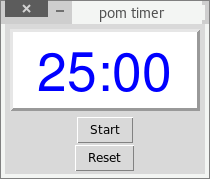

Pomodoro Timer
==============

A simple GUI countdown timer for your pomodoro sessions.

Pomodoro? What's that?
----------------------

From <https://en.wikipedia.org/wiki/Pomodoro_Technique>:

"*The Pomodoro Technique is a time management method developed by Francesco
Cirillo in the late 1980s. The technique uses a timer to break down
work into intervals, traditionally 25 minutes in length, separated by
short breaks. These intervals are named pomodoros, the plural in English
of the Italian word pomodoro (tomato), after the tomato-shaped kitchen
timer that Cirillo used as a university student. The method is
based on the idea that frequent breaks can improve mental agility.*"

Screenshot
----------

Usage
-----

    $ ./pom-timer.py

I suggest creating a desktop icon (see the `icon.png`) file and point
the icon to `launcher.sh`. The launcher script will start the GUI timer.

When I start the timer, I like to minimize it. When the time is up, a
sound file is played *and* the timer's window appears on your screen
(even if it was minimized).

Help:

    $ ./pom_timer.py -h
    Jabba's Pomodoro Timer v0.1

    Usage: ./pom_timer.py [parameter]

    Parameters:
    -h, --help        this help
    -play             play the sound and quit (for testing the volume)
    <minutes>         If not specified, then the default value is 25.

Dependencies
------------

Install the following packages with your package manager:
* wmctrl
* xdotool
* sox

The GUI is based on Tkinter. For Python 3 I had to install it too
(Manjaro: `sudo pacman -S tk`, Ubuntu: `sudo apt-get install python3-tk`).

Links
-----

I found a basic GUI counter at
[daniweb.com](https://www.daniweb.com/programming/software-development/threads/464062/countdown-clock-with-python)
that I extended.

I heard about the Pomodoro technique in this project:
[pomodoro.py](https://github.com/Luxtylo/pomodoro.py).
The sound file is borrowed from here.

Tips
----

I prefer managing my TODO list on a sheet of paper. I collect the tasks to do
and I leave a margin on the right side. I use this timer for a session: I start
the counter and minimize the timer, so it doesn't cause any stress or distraction.
When the time is up, I draw a small circle on the margin next to the task. The
circle represents a *tomato*, a finished session.
